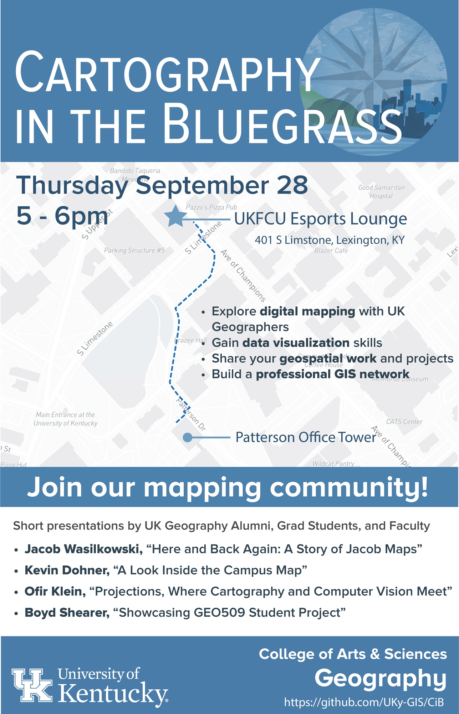

# Cartography in the Bluegrass

A repository to host mapping events organized by UK's Department of Geography and enriched through the participation of the broader community.

Curious about modern mapping techniques? Have a mapping portfolio that you would like to share? Join our community!

## Schedule

- Wednesday, April 12, 2023 5 - 6pm
  - Introductions
  - Short presentations by UK Geographers
  - Post-presentation meet and greet
- Where: Esports Theater & Lounge, [The Cornerstone](https://cornerstone.uky.edu/)
  - Parking is available in the neighboring parking structure

